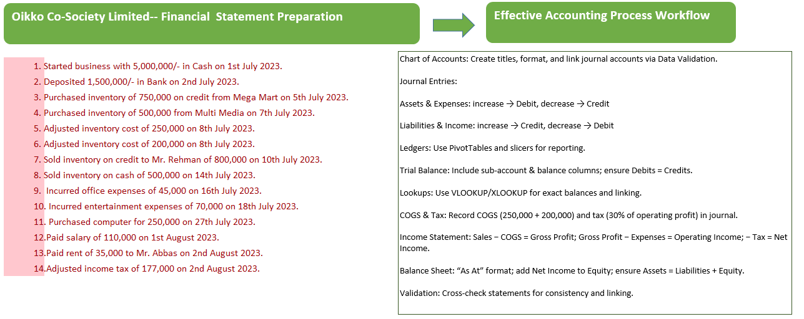
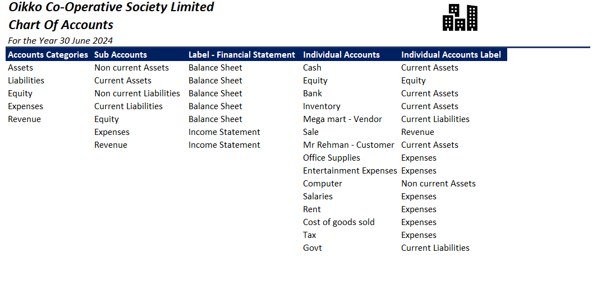

# Oikko-Co-Society-Limited---Financial-Statement-Preparation
This repository contains a complete accounting workflow, including journal entries, ledger setup, trial balance, income statement, and balance sheet. It demonstrates key accounting concepts such as COGS, tax adjustments, and linking financial statements in Excel. The workflow is structured for learning, analysis, and reporting purposes.

---

---

### Accounting Workflow – Key Points

1. **Chart of Accounts:** Create titles, format, and link journal accounts via Data Validation.
2. **Journal Entries:** 
   - Assets & Expenses: increase → Debit, decrease → Credit
   - Liabilities & Income: increase → Credit, decrease → Debit
3. **Ledgers:** Use PivotTables and slicers for reporting.
4. **Trial Balance:** Include sub-account & balance columns; ensure Debits = Credits.
5. **Lookups:** Use VLOOKUP/XLOOKUP for exact balances and linking.
6. **COGS & Tax:** Record COGS (250,000 + 200,000) and tax (30% of operating profit) in the journal.
7. **Income Statement:** Sales − COGS = Gross Profit; Gross Profit − Expenses = Operating Income; − Tax = Net Income.
8. **Balance Sheet:** “As At” format; add Net Income to Equity; ensure Assets = Liabilities + Equity.
9. **Validation:** Cross-check statements for consistency and linking.

---

---

## ✅ What You Gain from This Project

- Hands-on practice in **full accounting cycle**: journal → ledger → trial balance → financial statements.  
- Skills in **Excel automation** (PivotTables, Data Validation, VLOOKUP/XLOOKUP).  
- Understanding of **COGS, tax adjustment, and profit calculation**.  
- Ability to **link financial statements** (Income Statement ↔ Balance Sheet).  
- A professional workflow to showcase as a **portfolio project** on GitHub.  

---

## 🛠️ Problem Solved by This Project

- Converts **raw accounting transactions** into **structured financial reports**.  
- Reduces **manual errors** by using Excel functions & automation.  
- Helps **students or beginners** understand how journal entries flow into statements.  
- Ensures accuracy with the rule: **Assets = Liabilities + Equity**.  
- Bridges **accounting theory** with **Excel practice**.  

